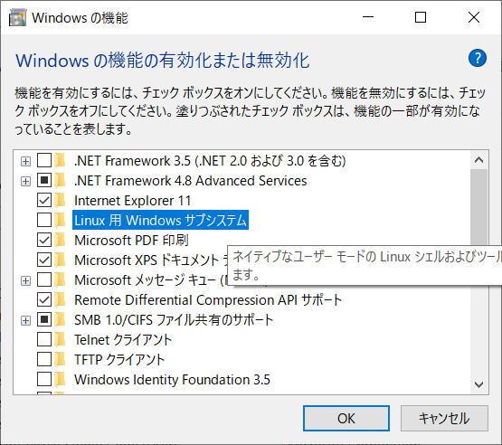
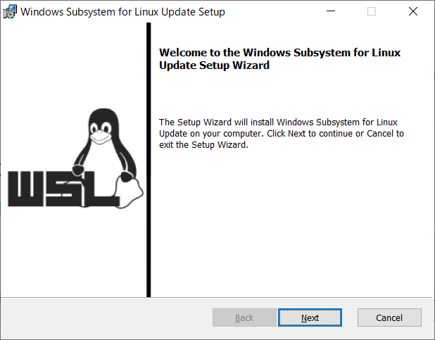

[Windows 10大型アップデート「May 2020 Update」がダウンロード開始](https://pc.watch.impress.co.jp/docs/news/1255256.html) という記事を見て、さっそく更新して、WSLとUbuntuをインストールしてみた。




とくに問題なく完了。

そしてdockerもインストール。
https://docs.docker.com/engine/install/ubuntu/
`Add Docker’s official GPG key:`のところでエラー。

WSLをインストールしただけでは、WSL2ではないらしい。
https://github.com/microsoft/WSL/issues/5125

WSL2を有効にするには、「Linux用Windowsサブシステム」だけではなく、「Windowsハイパーバイザー プラットフォーム」と「仮想マシン プラットフォーム」もオンにする必要があるらしい。

カーネルコンポーネントの更新も。
https://docs.microsoft.com/en-us/windows/wsl/wsl2-kernel からインストーラーをダウンロードして実行。




```
C:\Users> wsl --set-default-version 2
WSL 2 を実行するには、カーネル コンポーネントの更新が必要です。詳細については https://aka.ms/wsl2kernel を参照してください

C:\Users> wsl --set-default-version 2
WSL 2 との主な違いについては、https://aka.ms/wsl2 を参照してください

C:\Users>wsl -l -v
  NAME      STATE           VERSION
* Ubuntu    Stopped         1

C:\Users>wsl --set-version Ubuntu 2
変換中です。この処理には数分かかることがあります...
WSL 2 との主な違いについては、https://aka.ms/wsl2 を参照してください
変換が完了しました。

C:\Users>wsl -l -v
  NAME      STATE           VERSION
* Ubuntu    Stopped         2
```
ここまでのコマンド。VERSIONが2になった。

dockerインストール再開。
途中でGRUBのインストール先を聞かれるが、必要ない（はず）なのでなしで続ける。

インストール終わって動作確認、のところでまた躓く。dockerdが起動していないということなので、手動で起動してやる。
```
$ sudo docker run hello-world
docker: Cannot connect to the Docker daemon at unix:///var/run/docker.sock. Is the docker daemon running?.
See 'docker run --help'.
$ sudo service docker start
 * Starting Docker: docker  
```
やっとdockerが使えるようになった。

sudoなしで実行できるようにグループに所属させる
```
$ sudo usermod -aG docker `whoami`
```

VSCodeの`Remote - WSL`で接続して、`Docker`拡張機能入れて、情報が見れることを確認。

これで開発環境が整った感。
Docker for Windowsを使わなかった理由は、通常時のリソース消費を抑えたかったから。
実際効果があるかは使っていく中で答え合わせしていくことになるかと。
