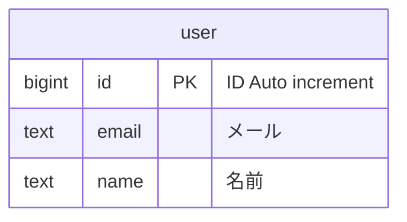
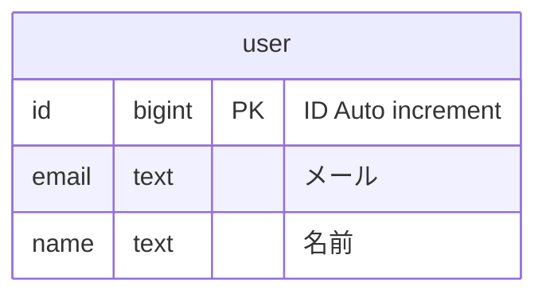

VS Codeのmermaid拡張でER図を試していて、カラム名に日本語使えなくて論理名と物理名両方書きたいのにどうしようかと思ったら、コメントとして書けば日本語も通ることに気づいた。

[mermaid - Markdownish syntax for generating flowcharts, sequence diagrams, class diagrams, gantt charts and git graphs.](https://mermaid-js.github.io/mermaid/#/./entityRelationshipDiagram?id=attribute-keys-and-comments)

つまり、こう書ける。

型とカラム名はどっちが先でも通るっぽい。

こっちのほうがDDLに近いから良い気がするんだけど、どうだろう。
